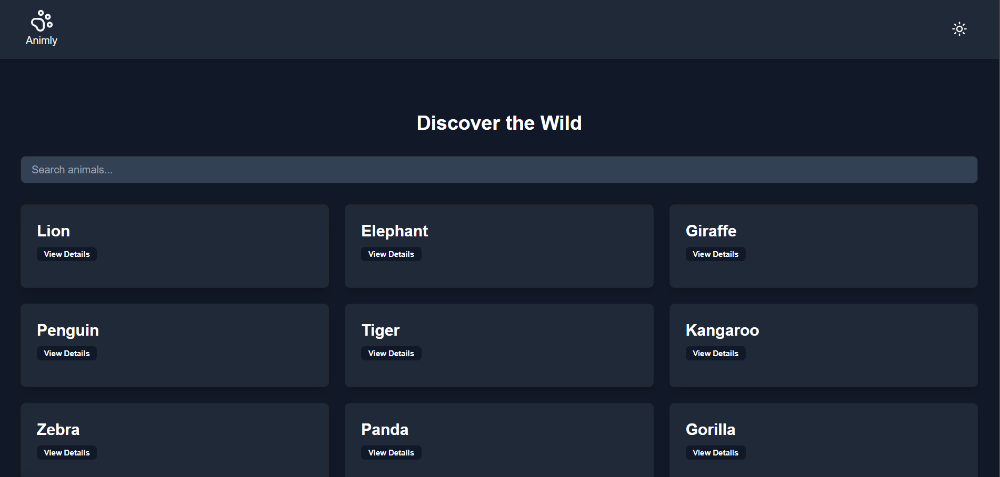

# Animly

This is a web-based Animal Encyclopedia built using **Next.js**. It allows users to explore and learn about various animals, including their scientific names, habitats, behaviors, and other fascinating details.

## Features

- **Search Functionality**: Quickly search for animals by their names.
- **Animal Details**: Detailed information about each animal, including:
  - Scientific Name
  - Habitat
  - Behavior
  - Diet
- **Responsive Design**: Fully responsive for both desktop and mobile devices.
- **Dynamic Routing**: Each animal has its own dedicated page with detailed information.
- **Demo Image**:



## Technologies Used

- **Next.js**: Framework for building server-rendered React applications.
- **React.js**: Frontend JavaScript library.
- **TailwindCSS**: For styling the application.
- **API Integration**: Fetch animal data dynamically from **API Ninjas** a  third-party API.

## Installation

1. Clone the repository:
   ```bash
   git clone https://github.com/SabbirCodes/Animly.git
   ```


3. Install dependencies:
   ```bash
   npm install
   ```

4. Start the development server:
   ```bash
   npm run dev
   ```

5. Open your browser and visit:
   ```
   http://localhost:3000
   ```

## Usage

- Use the search bar on the homepage to find animals.
- Click on an animal card to view detailed information about it.

## Contact

For any inquiries or suggestions, feel free to reach out at [sabbirhossain.py@gmail.com](mailto:sabbirhossain.py@gmail.com).

---

Enjoy exploring the **Wild**!

